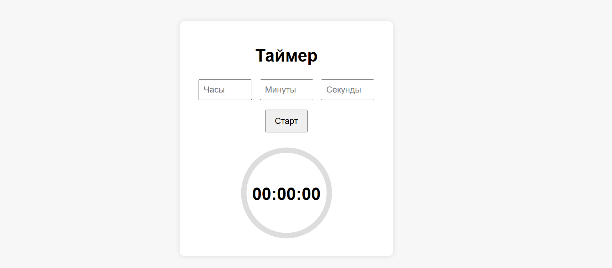
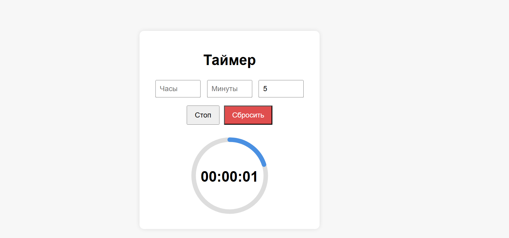
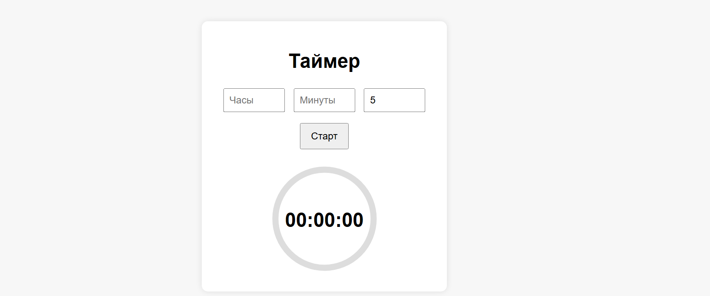

# Таймер обратного отсчёта

### Описание функционала
Пользователь может ввести время в три поля: часы, минуты и секунды, а затем управлять таймером с помощью кнопок.

#### Кнопка «Старт»
После ввода времени кнопка Старт запускает таймер и показывает, как время начинает уменьшаться.

#### Кнопка «Стоп»
Кнопка Стоп ставит таймер на паузу, чтобы он перестал отсчитывать время.

#### Кнопка «Продолжить»
Кнопка Продолжить возобновляет таймер с того места, на котором он был остановлен.

#### Кнопка «Сбросить**
Кнопка Сбросить полностью останавливает таймер.

